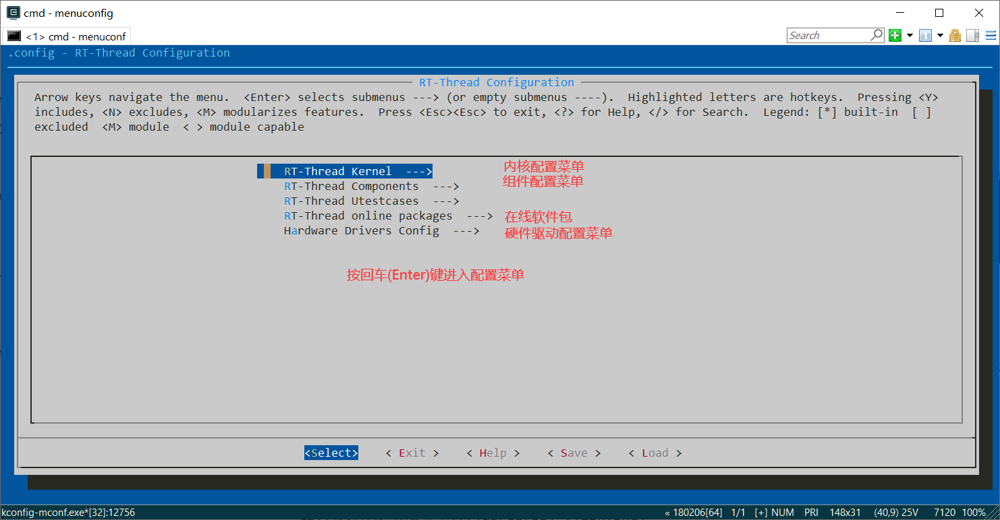
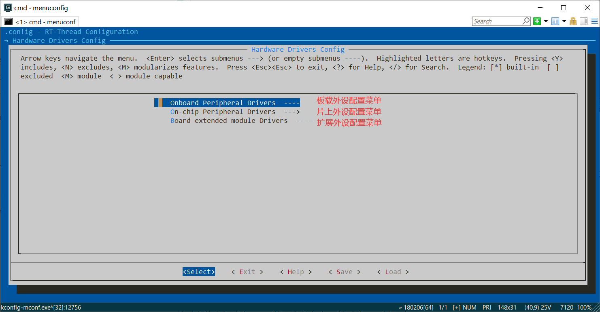
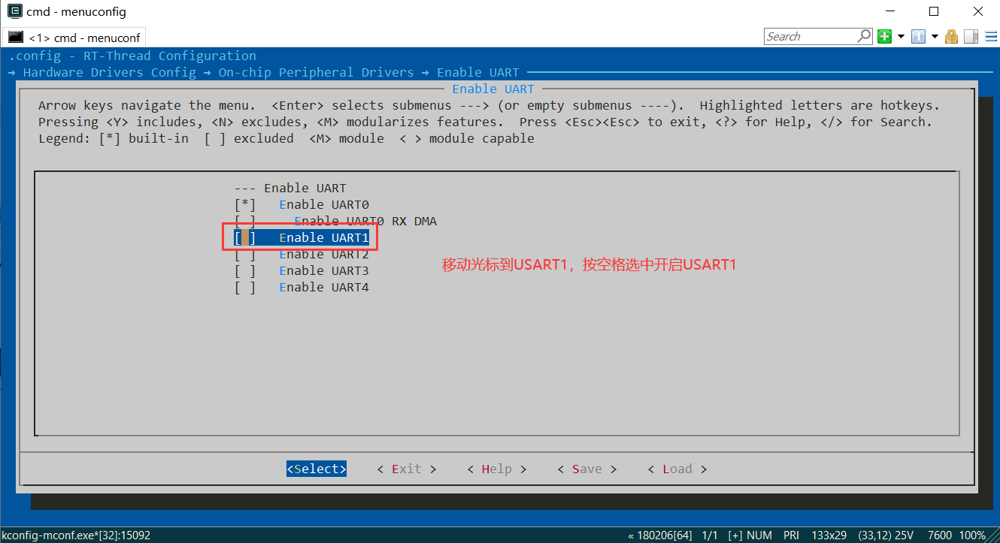
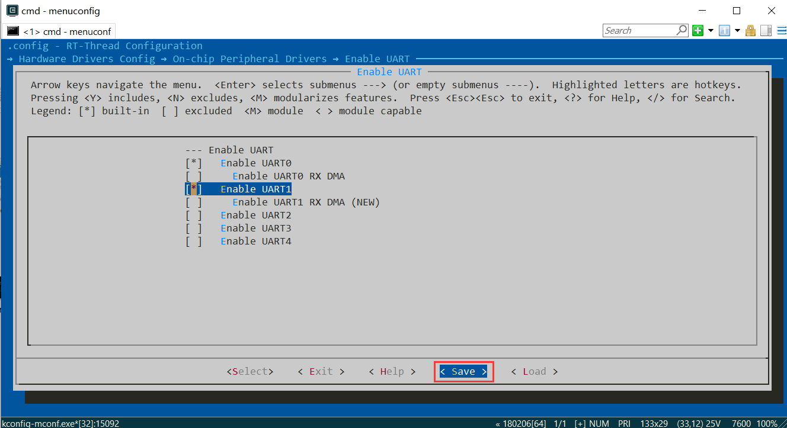

# GD32 RISC-V系列BSP外设驱动使用教程

## 简介

本文档是为需要在 RT-Thread 操作系统上使用更多开发板资源的开发者准备的。通过使用 ENV 工具对 BSP 进行配置，可以开启更多板载资源，实现更多高级功能。

主要包括以下内容：

1. 如何使用开发板上更多的板载资源
2. 如何使用更多的片上资源
3. 如何添加更多片上资源选项

## 前提要求

- 学会如何使用 ENV 工具，参考：[RT-Thread env 工具用户手册](https://www.rt-thread.org/document/site/programming-manual/env/env/)

## 如何使用更多的板载资源

开发板上一般有很多板载资源，如 Flash、SD卡等，但是 BSP 工程默认没有开启这些外设驱动。RT-Thread 提供了 ENV 工具来开启或关闭 BSP 的外设驱动。下面以在GD32VFf103V-EVAL开发板上开启 UART1驱动为例，一步步的展示如何使用 ENV 工具对 BSP 进行配置。

### 1）打开配置工具

在目录 `rt-thread\bsp\gd32\risc-v\gd32vf103v-eval` 下打开 menuconfig 配置界面。

打开的配置工具界面如下所示：

通过键盘上的上下键移动光标，选中 `Hardware Drivers Config`然后按回车键进入硬件驱动配置菜单。

### 2）进入硬件驱动配置菜单

在硬件配置菜单里有三个选项，分别是 **板载外设配置菜单**、**片上外设配置菜单**和**扩展模块配置菜单**，按回车键进入板载外设配置菜单。

### 3）在板载外设配置菜单里开启 UART1 选项

### 4）保存退出

然后右移光标选中 Save 按回车键保存，然后按 Esc 键退出配置工具。

### 5）更新软件包

输入命令 `pkgs --update` 使软件包配置生效。

### 6）编译

直接使用gcc编译程序。

值得注意的是，使用gcc编译程序，需要先配置好RISC-V系列MCU的交叉编译工具链。

### 7）下载

下载工具可以使用J-Link/GD-Link，可使用GD官方的DFU，也可使用OpenOCD下载。

### 8）查看运行结果

程序运行后，输入命令 `list_device` 可以看到名为 uart1的设备，此时 `UART1` 设备已经可以使用了。

## 总结

当开发者需要使用未开启的外设时，只要在 ENV 工具中使能相关的外设即可，重新生成的工程中就会添加对应的驱动文件。开发者就可以利用 RT-Thread 提供的驱动开快速开发应用了。